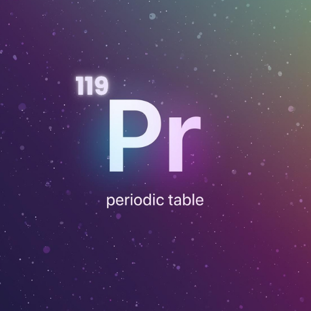
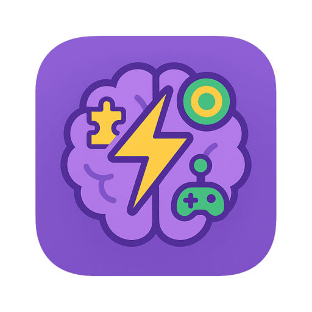

<h1 align="center">Hi 👋, I'm Furkan Çağlar</h1>
<h3 align="center">Flutter developer · end-to-end mobile products</h3>

  <b>Flutter</b> apps · <b>.NET</b> backend · <b>PostgreSQL</b> · <b>Docker</b> deploy · production <b>monitoring</b>

  
  &nbsp;
  

---

## 📱 App Showcase

  <i>All apps available on iOS & Android</i>

<table>
  <tr>
    <td width="50%" valign="top" align="center">

 

**Gallery Cleaner: Swipe Photo**

 

🛠️ Utilities · Latest Release

  

AI-powered gallery cleaner. Find duplicates, remove blurry photos, and free up storage with a fast swipe interface.

  

&nbsp;

    </td>
    <td width="50%" valign="top" align="center">

 

**SpookyAI: Halloween Image Gen**

 

📸 Photo & Video

  

Transform selfies into spooky Halloween scenes with AI. Hundreds of themed prompts for cinematic, creepy, and fun edits.

  

&nbsp;

    </td>
  </tr>
  <tr>
    <td width="50%" valign="top" align="center">

 

 

**Periodic Table: Learn & Play**

 

📚 Education

  

Learn all 118 elements through quizzes, puzzles, trivia, and widgets. Gamified chemistry for students and teachers.

  

&nbsp;

    </td>
    <td width="50%" valign="top" align="center">

 

 

**Quicko – Minigames**

 

🎮 Games

  

10+ casual minigames for brain training. Global leaderboards, favorites, achievements, and 11-language support.

  

&nbsp;

    </td>
  </tr>
</table>

---

## 👨‍💻 About Me

- Computer engineer focused on **full-stack mobile product development**
- **Flutter** for cross-platform iOS & Android apps
- **.NET** backend services and REST APIs
- **PostgreSQL** for data modeling and persistence
- **Docker** for containerized deployment
- Production **monitoring** and observability for live apps
- [Resume (PDF)](https://github.com/user-attachments/files/22393646/caglar-furkan-resume.16.pdf)
- Writing on [Medium](https://medium.com/@caglarrfurkann)

## 📫 Contact

**[caglarrfurkann@gmail.com](mailto:caglarrfurkann@gmail.com)**
